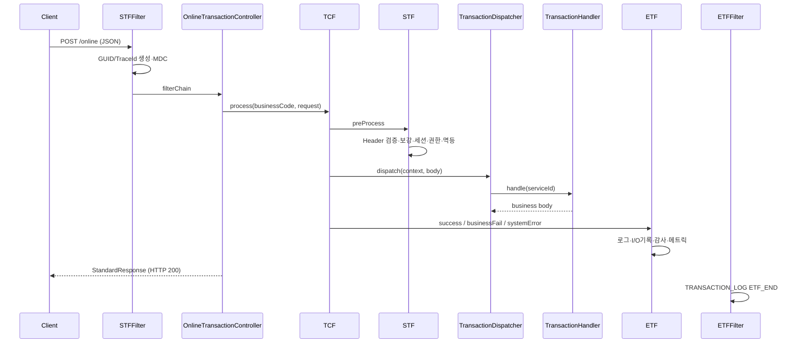
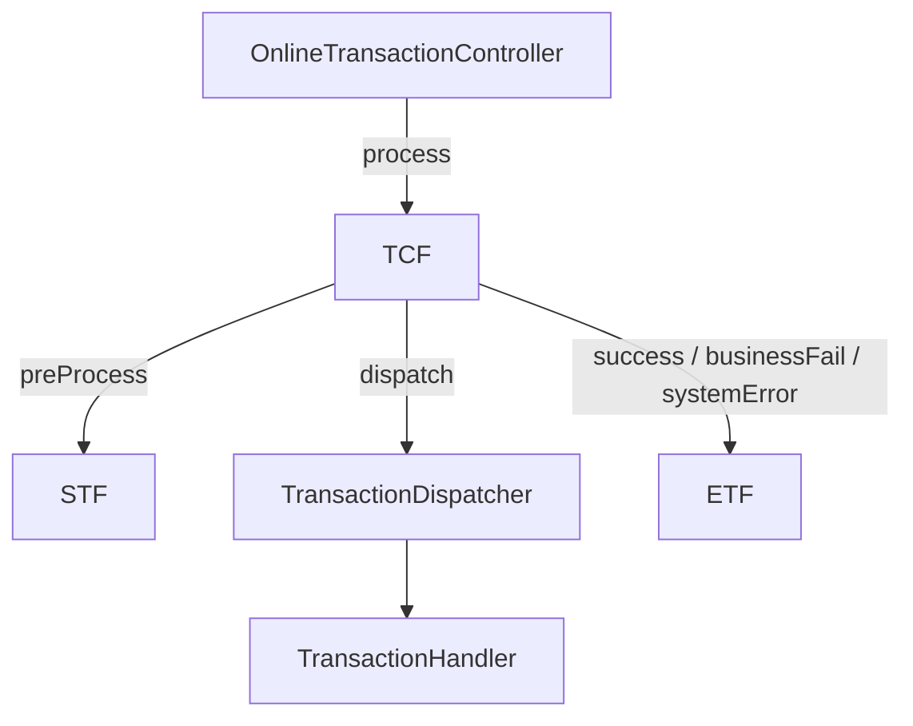

# common-web — NSIGHT 공통 Web 처리 프레임워크

Spring Boot Web 기반의 **온라인 거래 처리 파이프라인**을 제공합니다. Controller, Filter, STF/TCF/ETF, Handler 디스패치, 설정·로깅·I/O 기록 연동을 담당하며, 모든 업무 WAS(`*-service`)가 공통으로 의존합니다.

| 항목 | 값 |
|------|-----|
| Gradle 모듈 | `common-web` |
| 플러그인 | `java-library` |
| Java | 21 |
| 의존성 | `common-core` (api), `spring-boot-starter-web` (api), `spring-boot-starter-validation` (api), `spring-boot-starter-actuator` |
| Spring Boot BOM | 3.3.5 |

> 표준 전문 DTO·`TransactionContext`·`LocalBootRun`은 [`common-core`](../common-core/README.md)에 있습니다. WAR 외부 Tomcat 배포용 `NsightBootApplication`은 **이 모듈**에 있습니다.

---

## 목차

1. [모듈 역할](#1-모듈-역할)
2. [처리 흐름](#2-처리-흐름)
3. [패키지 구조](#3-패키지-구조)
4. [HTTP 엔드포인트](#4-http-엔드포인트)
5. [STF / TCF / ETF (processor 패키지)](#5-stf--tcf--etf-processor-패키지)
   - [5.1 패키지 개요](#51-패키지-개요)
   - [5.2 STF.java](#52-stfjava)
   - [5.3 TCF.java](#53-tcfjava)
   - [5.4 ETF.java](#54-etfjava)
   - [5.5 Filter와의 관계](#55-filter와의-관계)
6. [Handler 디스패치](#6-handler-디스패치)
7. [Servlet Filter](#7-servlet-filter)
8. [설정 (Properties)](#8-설정-properties)
9. [부가 서비스](#9-부가-서비스)
10. [WAR 배포 (NsightBootApplication)](#10-war-배포-nsightbootapplication)
11. [업무 모듈 연동](#11-업무-모듈-연동)
12. [관련 문서](#12-관련-문서)

---

## 1. 모듈 역할

```text
HTTP POST /online
  → STFFilter              (GUID·TraceId·MDC)
  → OnlineTransactionController
  → TCF
       → STF               (헤더 검증·보강·보안·로그 시작)
       → TransactionDispatcher → TransactionHandler (업무)
       → ETF               (응답 조립·로그 종료·I/O 기록)
  → ETFFilter              (요청 단위 종료 로그)
```

| 책임 | common-core | common-web |
|------|:-----------:|:----------:|
| `StandardRequest` / `StandardResponse` | ✓ | |
| `TransactionContext` | ✓ | |
| REST Controller, Filter | | ✓ |
| STF / TCF / ETF 파이프라인 | | ✓ |
| `TransactionHandler` 라우팅 | | ✓ |
| `NsightBootApplication` (WAR) | | ✓ |

업무 모듈은 `implementation project(':common-web')`만 추가하면 Controller·Filter·Dispatcher가 자동 등록됩니다. `@SpringBootApplication(scanBasePackages = "com.nh.nsight.marketing")`으로 공통·업무 Bean을 함께 스캔합니다.

---

## 2. 처리 흐름



**예외 처리 원칙**

| 예외 | ETF 처리 | HTTP | `Result.status` |
|------|----------|:----:|-----------------|
| `BusinessException` | `businessFail` | 200 | `FAIL` |
| 기타 `Exception` | `systemError` | 200 | `ERROR` |

업무 실패도 HTTP 200 + `result.status`로 구분합니다 (표준 전문 규약).

---

## 3. 패키지 구조

```text
com.nh.nsight.marketing.common
├── boot/
│   └── NsightBootApplication       WAR 외부 Tomcat 배포
└── web/
    ├── controller/
    │   └── OnlineTransactionController
    ├── processor/
    │   ├── STF                       Start Transaction Framework
    │   ├── TCF                       Transaction Control Framework
    │   └── ETF                       End Transaction Framework
    ├── dispatch/
    │   ├── TransactionDispatcher
    │   └── TransactionHandler        업무 Handler 인터페이스
    ├── filter/
    │   ├── STFFilter
    │   └── ETFFilter
    ├── validation/
    │   └── StandardHeaderValidator
    ├── security/
    │   ├── SessionValidator
    │   └── AuthorizationValidator
    ├── duplicate/
    │   └── IdempotencyChecker
    ├── log/
    │   └── TransactionLogService
    ├── audit/
    │   └── AuditLogService
    ├── monitoring/
    │   └── MetricsPublisher
    ├── etc/
    │   └── TransactionIoRecordPublisher
    └── config/
        ├── NsightWebConfiguration
        ├── BusinessModuleProperties
        └── EtcRecordProperties
```

---

## 4. HTTP 엔드포인트

`OnlineTransactionController`가 제공하는 엔드포인트입니다.

| Method | Path | 설명 |
|--------|------|------|
| POST | `/online` | 표준 온라인 거래 (Header `businessCode` 사용) |
| POST | `/{businessCode}/online` | URL path 업무코드 포함 (Tomcat context + path 조합) |

- **Content-Type:** `application/json`
- **요청 본문:** `StandardRequest<Map<String, Object>>`
- **응답 본문:** `StandardResponse<Object>`
- GET은 지원하지 않습니다.

**URL 예시**

| 배포 | URL |
|------|-----|
| bootRun (`sv-service`, port 8085) | `http://localhost:8085/online` |
| Tomcat (context `/sv`) | `http://localhost:8080/sv/online` |
| path 업무코드 | `http://localhost:8080/sv/SV/online` |

Tomcat에서는 WAR context path(`/{code}`) + Controller mapping(`/online` 또는 `/{businessCode}/online`) 조합으로 접근합니다.

---

## 5. STF / TCF / ETF (processor 패키지)

경로: `common-web/src/main/java/com/nh/nsight/marketing/common/web/processor/`

온라인 거래의 **시작(STF) · 제어(TCF) · 종료(ETF)** 를 담당하는 3개 `@Component`입니다.  
Controller(`OnlineTransactionController`)는 JSON 역직렬화 후 **`TCF.process()`만** 호출하며, 업무 Handler는 TCF가 Dispatcher를 통해 invoke합니다.

```text
OnlineTransactionController
        │
        ▼
   TCF.process()  ─────────────────────────────────────┐
        │                                              │
        ├─► STF.preProcess()     … 거래 시작 전처리      │
        ├─► TransactionDispatcher … 업무 Handler       │
        └─► ETF.success|fail|error … 응답 조립·후처리 ◄─┘
```

| 클래스 | 약칭 | 역할 |
|--------|------|------|
| `STF` | Start Transaction Framework | Header 검증·보강, Context 생성, 보안·로그 **시작** |
| `TCF` | Transaction Control Framework | STF → Dispatcher → ETF **오케스트레이션**, 예외 분기 |
| `ETF` | End Transaction Framework | Result·Response 조립, 로그·I/O·감사 **종료** |

---

### 5.1 패키지 개요

#### 호출 관계



#### Spring Bean 의존성

| 클래스 | 주입받는 Bean |
|--------|---------------|
| **STF** | `StandardHeaderValidator`, `SessionValidator`, `AuthorizationValidator`, `IdempotencyChecker`, `TransactionLogService` |
| **TCF** | `STF`, `TransactionDispatcher`, `ETF` |
| **ETF** | `TransactionLogService`, `AuditLogService`, `MetricsPublisher`, `TransactionIoRecordPublisher` |

#### 예외 처리 (TCF → ETF)

| 발생 위치 | 예외 | TCF 분기 | ETF 메서드 | `Result.status` |
|-----------|------|----------|------------|-----------------|
| STF / Validator / Handler | `BusinessException` | catch | `businessFail` | `FAIL` |
| Handler / DB / 기타 | `Exception` | catch | `systemError` | `ERROR` |
| 정상 | — | try 정상 종료 | `success` | `SUCCESS` |

모든 경우 **HTTP 200** + `StandardResponse` JSON 반환 ([§2](#2-처리-흐름)).

---

### 5.2 STF.java

**파일:** `processor/STF.java`  
**공개 API:** `preProcess(String pathBusinessCode, StandardRequest<Map<String, Object>> request)`

거래 **시작 전처리**를 수행하고 `TransactionContext`를 반환합니다.

#### `preProcess` 실행 순서

| 순서 | 처리 | 클래스·메서드 |
|------|------|---------------|
| 1 | Header 검증·정규화 | `StandardHeaderValidator.validateAndNormalize(header, pathBusinessCode)` |
| 2 | Header 시각·일자 보강 | `STF.applyStartHeader(header)` |
| 3 | Context 생성 | `new TransactionContext(header, header.copy(), Instant.now())` |
| 4 | URL path 업무코드 저장 | `context.setPathBusinessCode(pathBusinessCode)` |
| 5 | MDC 설정 | `guid`, `traceId`, `userId`, `branchId`, `serviceId` |
| 6 | 세션 검증 (옵션) | `SessionValidator.validate(context)` |
| 7 | 권한 검증 (옵션) | `AuthorizationValidator.validate(context)` |
| 8 | 멱등 검증 (옵션) | `IdempotencyChecker.check(context)` |
| 9 | 거래 시작 로그 | `TransactionLogService.start(context)` → `TRANSACTION_LOG` TX_START |

#### `pathBusinessCode` 인자

Controller에서 전달됩니다.

| Controller mapping | `pathBusinessCode` |
|--------------------|--------------------|
| `POST /online` | `null` |
| `POST /{businessCode}/online` | path 변수 (예: `"SV"`) |

`StandardHeaderValidator`는 path·모듈·Header의 `businessCode` 일치 여부를 검사합니다 ([§11 Header 검증 규칙 요약](#header-검증-규칙-요약)).

#### `TransactionContext` 생성 방식

```java
TransactionContext context = new TransactionContext(
        request.getHeader(),      // header — 이후 ETF까지 mutating (응답 Header 원본)
        request.getHeader().copy(), // requestHeader — ET I/O 기록용 스냅샷
        Instant.now());           // startTime — ETF elapsedTimeMs 계산
```

- **`header`**: STF 보강 후 객체. ETF `applyEndHeader`에서 outtime 등 추가 기록
- **`requestHeader`**: 보강 직후 `copy()`. [`TransactionIoRecordPublisher`](src/main/java/com/nh/nsight/marketing/common/web/etc/TransactionIoRecordPublisher.java)가 inputHeader로 사용

#### `applyStartHeader` (private)

클라이언트 Header에 비어 있는 시각·일자 필드를 KST 기준으로 채웁니다.

| 필드 | 동작 |
|------|------|
| `businessCode` | 대문자 변환 |
| `transactionIntime` | blank → `DateTimeUtil.nowKst()` |
| `requestTime` | blank → `transactionIntime`과 동일 |
| `systemDate` | blank → `DateTimeUtil.todayKst()` (`yyyyMMdd`) |
| `bizDate` | blank → `systemDate` |

#### STF에서 throw 가능한 예외

`StandardHeaderValidator`, `SessionValidator` 등에서 `BusinessException` 발생 → TCF가 catch하여 `ETF.businessFail` 호출.  
STF 단계에서 throw되면 **Dispatcher·Handler는 실행되지 않습니다**.

---

### 5.3 TCF.java

**파일:** `processor/TCF.java`  
**공개 API:** `process(String pathBusinessCode, StandardRequest<Map<String, Object>> request)`

한 번의 온라인 거래에 대해 STF → 업무 처리 → ETF를 **단일 진입점**으로 연결합니다.

#### `process` 의사 코드

```java
public StandardResponse<Object> process(String pathBusinessCode, StandardRequest request) {
    TransactionContext context = stf.preProcess(pathBusinessCode, request);

    try {
        Object body = transactionDispatcher.dispatch(context, request.getBody());
        return etf.success(context, body);
    } catch (BusinessException e) {
        return etf.businessFail(context, e);
    } catch (Exception e) {
        return etf.systemError(context, e);
    }
}
```

#### 분기별 동작

| 경로 | Handler 실행 | 응답 body | Result |
|------|:------------:|-----------|--------|
| 정상 | ✓ | Handler 반환값 | `Result.success(elapsedMs)` |
| `BusinessException` | (throw 지점까지) | `null` | `Result.fail(errorCode, message, elapsedMs)` |
| `Exception` | (throw 지점까지) | `null` | `Result.error("E-COM-SYS-9999", "시스템 처리 중...", elapsedMs)` |

#### `BusinessException` vs `Exception`

- **`BusinessException`** ([`common-core`](../common-core/README.md#5-예외-exception)): 업무 Rule, Header 검증, Handler 미등록(`E-COM-HDL-0001`) 등 **예상 가능한 실패**
- **`Exception`**: DB 장애, NPE 등 **시스템 오류** — 클라이언트에는 고정 메시지(`E-COM-SYS-9999`), 상세는 서버 로그

#### Context 가용성

`stf.preProcess`가 완료된 **이후** catch 블록에서도 `context`는 유효합니다.  
STF `preProcess` **이전** 오류(Controller `@Valid` 실패 등)는 TCF까지 도달하지 않습니다.

---

### 5.4 ETF.java

**파일:** `processor/ETF.java`  
**공개 API:** `success`, `businessFail`, `systemError`

거래 **종료 후처리** 및 `StandardResponse` 조립. 세 public 메서드 모두 내부 `build()`로 수렴합니다.

#### public 메서드

| 메서드 | 호출 조건 | Result 생성 |
|--------|-----------|-------------|
| `success(context, body)` | Handler 정상 반환 | `Result.success(elapsed(context))` → `S0000` |
| `businessFail(context, e)` | `BusinessException` | `Result.fail(e.getErrorCode(), e.getMessage(), elapsed)` |
| `systemError(context, e)` | 기타 `Exception` | `Result.error("E-COM-SYS-9999", "시스템 처리 중 오류가 발생했습니다.", elapsed)` |

`elapsed(context)` = `Duration.between(context.getStartTime(), Instant.now()).toMillis()`

#### `build(context, result, body)` (private) — 공통 종료 파이프라인

| 순서 | 처리 | 설명 |
|------|------|------|
| 1 | `applyEndHeader(context.getHeader())` | `transactionOuttime`, `responseTime` (KST) 보강 |
| 2 | `responseHeader = context.getHeader().copy()` | 응답 JSON용 Header 스냅샷 |
| 3 | `transactionLogService.end(context, result)` | `TRANSACTION_LOG` TX_END |
| 4 | `transactionIoRecordPublisher.publish(...)` | ET REST I/O 기록 (`nsight.etc.record-enabled`) |
| 5 | `auditLogService.auditIfRequired(context)` | Customer/download serviceId 감사 |
| 6 | `metricsPublisher.publish(context, result)` | debug 메트릭 |
| 7 | `MDC.clear()` | SLF4J MDC 정리 |
| 8 | `StandardResponse.of(responseHeader, result, body)` | 최종 응답 객체 |

실패·오류 경로(`businessFail`, `systemError`)에서도 **동일한 `build` 파이프라인**이 실행됩니다. body는 `null`.

#### `applyEndHeader` (private)

| 필드 | 동작 |
|------|------|
| `transactionOuttime` | `DateTimeUtil.nowKst()` |
| `responseTime` | `transactionOuttime`과 동일 |
| `systemDate` | blank → `DateTimeUtil.todayKst()` |
| `bizDate` | blank → `systemDate` |

#### 응답 JSON 구조

```json
{
  "header": { "...": "..." },
  "result": {
    "status": "SUCCESS|FAIL|ERROR",
    "resultCode": "S0000|E0001",
    "message": "...",
    "errorCode": "...",
    "elapsedTimeMs": 42
  },
  "body": { }
}
```

성공 시에만 `body`에 업무 데이터가 채워집니다.

---

### 5.5 Filter와의 관계

`processor` 패키지의 STF/ETF와 **이름은 같지만 별개**입니다.

| 구분 | 패키지 | 클래스 | 역할 |
|------|--------|--------|------|
| Processor | `web.processor` | `STF`, `TCF`, `ETF` | **전문(거래) 단위** 전처리·오케스트레이션·후처리 |
| Filter | `web.filter` | `STFFilter`, `ETFFilter` | **HTTP 요청/응답 단위** GUID·TraceId·요청 경과 시간 |

```text
HTTP Request
  → STFFilter          (Servlet, 최우선 순위)
  → Controller → TCF → STF(preProcess) … ETF(build)
  → ETFFilter          (Servlet, 최후 순위, ETF_END 로그)
HTTP Response
```

- Filter의 GUID/TraceId와 Processor STF의 Header `guid`/`traceId`는 **별도 생성 경로**가 있을 수 있음 (Header blank 시 `StandardHeaderValidator`가 보강)
- Processor ETF의 `MDC.clear()`와 ETFFilter finally의 MDC 정리가 **이중 방어**로 동작

Filter 상세: [§7 Servlet Filter](#7-servlet-filter)

---

## 6. Handler 디스패치

### `TransactionHandler` 인터페이스

업무 모듈에서 `@Component`로 구현합니다. **`serviceId`가 라우팅 키**입니다.

```java
@Component
public class SvSampleInquiryHandler implements TransactionHandler {

    @Override
    public String getServiceId() {
        return "SV.Sample.inquiry";
    }

    @Override
    public Object doHandle(TransactionContext context, Map<String, Object> body) {
        // Facade/Service 호출 후 Map 또는 DTO 반환
        return facade.inquiry(context, body);
    }
}
```

### `TransactionDispatcher`

Spring이 주입한 모든 `TransactionHandler` Bean을 `serviceId → handler` Map으로 등록합니다.

- Handler 미등록 시: `BusinessException("E-COM-HDL-0001", ...)`
- 기동 시 등록 목록이 콘sole에 출력됩니다

---

## 7. Servlet Filter

Filter는 Processor(STF/ETF)와 **별개**로 HTTP 요청 전후를 감쌉니다.

### `STFFilter` (`@Order(HIGHEST_PRECEDENCE)`)

| 동작 | 설명 |
|------|------|
| GUID | `X-GUID` 헤더 없으면 `GuidUtil.newGuid()` 생성 |
| TraceId | `X-Trace-Id` 헤더 없으면 `GuidUtil.newTraceId()` 생성 |
| Request attribute | `NSIGHT_REQUEST_START_TIME`, `NSIGHT_REQUEST_GUID`, `NSIGHT_REQUEST_TRACE_ID` |
| Response header | `X-GUID`, `X-Trace-Id` echo |
| MDC | `guid`, `traceId` (ETF에서 clear, Filter finally에서도 방어적 remove) |

### `ETFFilter` (`@Order(LOWEST_PRECEDENCE)`)

요청 처리 후 `TRANSACTION_LOG` logger로 `ETF_END` 한 줄을 남깁니다 (uri, status, elapsedMs).

---

## 8. 설정 (Properties)

`NsightWebConfiguration`이 `@EnableConfigurationProperties`로 아래 설정을 활성화합니다.

### `nsight.module.*` (`BusinessModuleProperties`)

| Property | 기본값 | 설명 |
|----------|--------|------|
| `system-id` | `NSIGHT-MP` | Header `systemId` 기본값 |
| `business-code` | (없음) | 모듈 고정 업무코드 (전문과 불일치 시 오류) |
| `ap-id` | `local-ap` | Header `apId` 기본값 |
| `session-validation-enabled` | `false` | 세션(`userId`) 검증 |
| `authorization-validation-enabled` | `false` | 권한 검증 (TODO) |
| `idempotency-enabled` | `false` | 멱등 검증 (TODO) |

**sv-service 예시** (`application.yml`):

```yaml
nsight:
  module:
    system-id: NSIGHT-MP
    business-code: SV
    ap-id: local-sv-ap01
    session-validation-enabled: false
    authorization-validation-enabled: false
    idempotency-enabled: false
```

### `nsight.etc.*` (`EtcRecordProperties`)

| Property | 기본값 | 설명 |
|----------|--------|------|
| `record-enabled` | `false` | ET I/O 기록 전송 여부 |
| `record-url` | `http://localhost:8098/et/transaction-io/record` | common-etc REST URL |

`record-enabled: true`이면 ETF 종료 시 `inputHeader`, `outputHeader`, `result`를 POST합니다. 실패해도 본 거래에는 영향 없음 (warn 로그).

---

## 9. 부가 서비스

| 클래스 | Logger / 동작 |
|--------|----------------|
| `TransactionLogService` | `TRANSACTION_LOG` — TX_START / TX_END |
| `AuditLogService` | `AUDIT_LOG` — serviceId에 `Customer` 또는 `download` 포함 시 |
| `MetricsPublisher` | debug 레벨 elapsed·status |
| `TransactionIoRecordPublisher` | common-etc REST 연동 |
| `StandardHeaderValidator` | Header 정규화·검증 (오류 코드 `E-COM-HDR-xxxx`) |
| `SessionValidator` | `E-COM-AUTH-0001` |
| `IdempotencyChecker` | CREATE/UPDATE/DELETE 등 변경성 거래 (구현 TODO) |

---

## 10. WAR 배포 (NsightBootApplication)

외부 Tomcat에 WAR를 올릴 때 Spring Boot embedded server 없이 기동하기 위한 베이스 클래스입니다.

```java
@SpringBootApplication(scanBasePackages = "com.nh.nsight.marketing")
public class SvApplication extends NsightBootApplication {

    @Override
    protected Class<?> primarySource() {
        return SvApplication.class;
    }

    public static void main(String[] args) {
        LocalBootRun.apply(8085);   // common-core
        SpringApplication.run(SvApplication.class, args);
    }
}
```

- `configure()` → Tomcat이 WAR 기동 시 `SpringApplicationBuilder`에 primary source 등록
- `main()` + `LocalBootRun` → IDE/`bootRun` 로컬 실행

---

## 11. 업무 모듈 연동

### Gradle

```gradle
dependencies {
    implementation project(':common-web')
}
```

### 필수 작업

1. `*Application` — `NsightBootApplication` 상속, `scanBasePackages = "com.nh.nsight.marketing"`
2. `application.yml` — `nsight.module.business-code` 설정
3. `TransactionHandler` — `@Component` + 고유 `serviceId`
4. (선택) Facade / Service / DAO — Handler에서 호출

### Header 검증 규칙 요약

| 규칙 | 오류 코드 |
|------|-----------|
| header 없음 | `E-COM-HDR-0001` |
| businessCode 없음 | `E-COM-HDR-0002` |
| URL path ≠ header businessCode | `E-COM-HDR-0003` |
| 모듈 businessCode ≠ header | `E-COM-HDR-0004` |
| serviceId / transactionCode / processingType 필수 | `E-COM-HDR-0005~0007` |
| 잘못된 processingType | `E-COM-HDR-0008` |

---

## 12. 관련 문서

- [프로젝트 README](../README.md)
- [common-core/README.md](../common-core/README.md) — 표준 전문 DTO·TransactionContext·LocalBootRun
- [README-TXFLOW.md](../README-TXFLOW.md) — 클래스·함수 단위 거래 흐름
- [docs/architecture.md](../docs/architecture.md) — 아키텍처·URL 원칙
- [demo-ui/README.md](../demo-ui/README.md) — 브라우저 테스트 Relay
- [docs/sample-requests/sv-sample-inquiry.json](../docs/sample-requests/sv-sample-inquiry.json) — SV 샘플 요청
